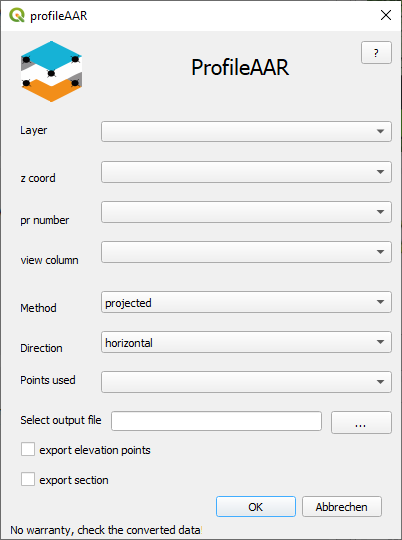
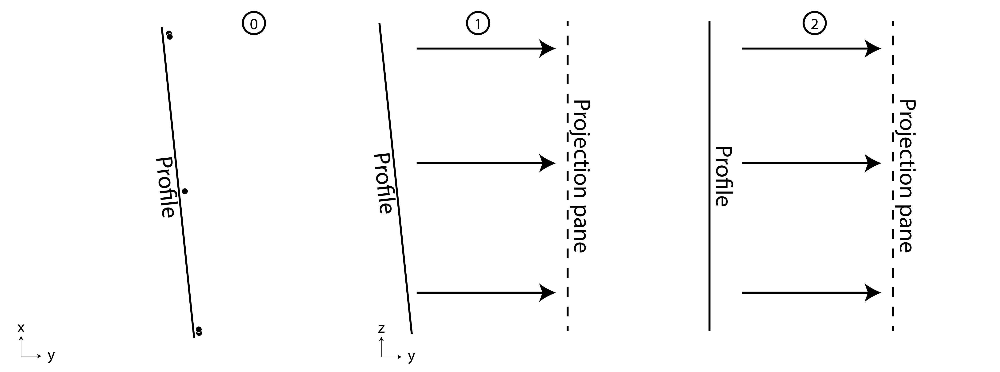
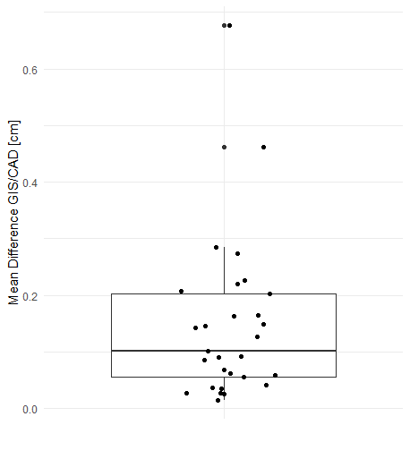
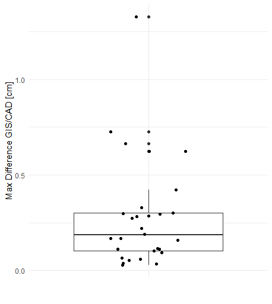

# Summary

profileAAR is a QGIS plugin with which the measurement data of archaeological sections / profiles are prepared in such a way that it is possible to rectify them with the QGIS georeferencer. It can be shown that a comparable result can be achieved for rectifying archaeological profile photos with the open source applications as with the proprietary software that was commenly in use.

# Statement of need / Introduction

For a long time, the standard method for documenting archaeological profiles and plana has been drawing in the field. In addition to the classic hand drawings, new, faster innovations came up in this area. This certainly included firstly the pantograph in which an analog drawing was created or the Trigomat, which enabled direct digital drawing.
With the advent of total station measurement and the connection to CAD systems, more and more recording was shifted directly to the PC. In order to include photographs of plana and profiles in these measurements, image-based methods (e.g. structure from motion) are of course available for more complex questions, but photogrammetry is also a possible way for less complex features. In order to implement this on the software side, the AutoCAD plugin PhoToPlan (now AsBuild) has prevailed [@guetter:2015].
It should be noted, however, that both AutoCAD and AsBuild are licensed and expensive to use. In the context of the increasing focus on the use of open source GIS in archeology and also in excavation technology (e.g. survey2gis or tachy2gis), the aim was to evaluate to what extent the functionality of the rectification of profiles and plans in QGIS was possible to implement. Using the georeferencer plug-in integrated in QGIS, it was previously possible to rectify Plana, but this was more difficult with profiles.
The problem here is that the section control points measured in the 3D space map the profile, but QGIS can only work with the 2.5D space. The plug-in profileAAR [@profileaar:2019] was developed to transform these points in such a way that rectification in QGIS is possible. It is possible to document profiles using SFM and thus form the basis for drawings and the like. In many cases (simple post holes or sectional profiles) the effort involved is not in proportion to the result, so that the possibility of rectifying single images should still be available.

# profileAAR

{ width=30% }

The Plugin is available on github and in the qgis extension manager [@profileaarqgis:2021]. 
To prepare the section control points, they had to be moved from their position to the 2D view in such a way that they could be used. In a classic hand drawing, two nails are attached to the profile at the same height and these are connected with a cord that is used as a zero line. This line is measured vertically up and down as possible in order to obtain the support points for a drawing. This means that the profile, whether straight or crooked, is in principle projected onto a vertical plane. Theoretically, I can achieve the same thing with photography if the camera will be aligned  horizontally in a balance and vertically orthogonally on the profile. Since this is hardly feasible in practice, georeferencing is necessary.
As a basis, a file is required in which the points are in a Cartesian coordinate system and the following parameters are available in columns at each point: z-value, profile number, view of the profile and whether the points should be used for calculating the rotation parameters (Tab. 1).

| z-Value        | section_no           | use  |
| ------------- |-------------| -----|
| 0.5 | 1 | N | 1 |
| 0.5 | 1 | N | 1 |
| 0.25 | 1 | N | 1 |
| 0 | 1 | N | 1 |
| 0 | 1 | N | 1 |
| 1.8 | 2 | E | 1 |
| 1.5 | 2 | E | 1 |
| 1 | 2 | E | 0 |
| 0.75 | 2 | E | 1 |
| 0.8 | 2 | E | 1 |
Tab. 1: Example of an attribute table

Several steps are necessary to prepare the profile nails for use - the points must be rotated around the z-axis so that the profile is parallel to the x-axis. In a subsequent step, they must then be rotated around the X axis. For each profile it must first be determined how it can be aligned parallel to the x-axis. In order to determine the rotation parameters, the mean in the point cloud of a profile is determined using a linear regression [@backhaus:2011] and the angle of rotation can then be calculated on the basis of the gradient. There are two important parameters that can be specified. On the one hand, it is important to know from which direction the photo was taken (**view** Fig. 1) and which points should be used to determine the rotation angle (**used** Fig. 1). With the latter, outliers in the measurement can be removed for the parameter determination - but they are still rotated (this procedure also allows finding points or similar to be attached to the profile, but only to rotate them and thus represent them on the profile). After determining the angle, the points are now aligned parallel to the X axis via translation and rotation. (In this context, the Direction selection menu (Fig. 1) can be used to determine whether the points are parallel to the profile section (original), parallel to the x-axis (horizontal) or parallel to the x-axis but with the smallest x-value = 0 ( original heigth). The latter enables a coordinate frame to be displayed around the profile in the layout function of Qgis.)
In the next step, the profile is folded in such a way that it is no longer vertical in space, but lies on the 2D surface. In the simple case, the z and y coordinates are swapped (Fig. 1 Method - **Projected**). This method methodically produces the result that is also achieved when a classic drawing is carried out in the field, as described above (Fig. 2). It is also possible to carry out this step in such a way that an orthogonal view of the profile is generated (Fig. 1 Method - **Surface**; Fig. 2-2). The procedure is the same as for the rotation around the z-axis.

{ width=90% }

To complete the functions, there is still the option of extracting the upper right photogrammetry points in order to be able to use them in the layout as height markers and the profile section, based on the outermost, highest nails, can be extracted as a shape file.
The georeferencer can now be used to finally rectify the photos of the profiles. After loading the images, the section control points can now be picked up and connected to the rotated points from profileAAR. In the following, the image is rectified using projective transformation [@qgis:2021].

# Accuracy
## Method for compairing the procedures
In order to compare the results of the rectification in QGIS with the previous and common method in AutoCAD, a test series of 29 profiles was rectified in both QGIS and AutoCAD. Since the processing of the images in the programs is very different and a pixel-by-pixel comparison cannot be carried out, a manual approach was therefore chosen. In order to be able to compare the procedures, the procedure had to be adapted as detailed as possible. For this purpose, a free UCS was first placed over the measured photogrammetry points in AsBuild Photo and the image on it was rectified. In the next step, a vertical UCS was created over the points and several points that were distributed and easily identified were marked in the image. The same points were then also marked in the rectified image in the GIS and the distances between the points were measured (Fig. 3). These distances form the basis of the comparison (Tab. 2).

| Profile no. | Axis no. | Distance [cm] Qgis    | Distance [cm] CAD     | Area       | No. of pictures | Difference [cm] |
|--------|-------|---------|---------|--------------|---------------|-----------|
| 16     | 1     | 85.663  | 85.779  | 0.2 m²       | 1             | -0.116    |
| 16     | 2     | 38.643  | 38.696  | 1.4 x 0.23 m |               | -0.053    |
| 16     | 3     | 32.796  | 32.788  |              |               | 0.008     |
| 16     | 4     | 31.372  | 31.324  |              |               | 0.048     |
| 23     | 1     | 32.326  | 32.348  | 0.5 m²       | 1             | -0.022    |
| 23     | 2     | 80.669  | 80.64   | 2.35 x 0.55m |               | 0.029     |
| 23     | 3     | 153.927 | 153.929 |              |               | -0.002    |
| 23     | 4     | 21.202  | 21.207  |              |               | -0.005    |
| 24     | 1     | 52.858  | 52.814  | 0.25 m²      | 1             | 0.044     |
| 24     | 2     | 107.371 | 107.257 | 0.3 x 1.3m   |               | 0.114     |
| 24     | 3     | 26.219  | 26.222  |              |               | -0.003    |
| 24     | 4     | 35.246  | 35.173  |              |               | 0.073     |
| 31     | 1     | 64.323  | 64.155  | 1.2 m²       | 1             | 0.168     |
| 31     | 2     | 111.203 | 111.178 | 1.15 x 1.3m  |               | 0.025     |
| 31     | 3     | 82.778  | 82.68   |              |               | 0.098     |
| 31     | 4     | 83.515  | 83.403  |              |               | 0.112     |
| 47     | 3     | 524.257 | 524.033 | 8.7m²        | 1             | 0.224     |
| 47     | 1     | 497.226 | 496.942 | 7 x 1.4m     |               | 0.284     |
| 47     | 2     | 128.589 | 128.611 |              |               | -0.022    |
| 47     | 4     | 199.206 | 198.928 |              |               | 0.278     |
| 52     | 1     | 226.563 | 226.716 | 6 m²         | 1             | -0.153    |
| 52     | 3     | 163.322 | 163.198 | 2.15 x 3.5m  |               | 0.124     |
| 52     | 4     | 181.653 | 181.874 |              |               | -0.221    |
| 52     | 2     | 174.268 | 174.274 |              |               | -0.006    |
| 147    | 4     | 565.224 | 565.044 | 6.5 m²       | 3             | 0.18      |
| 147    | 3     | 382.059 | 381.772 | 7 x 1.2m     |               | 0.287     |
| 147    | 2     | 137.639 | 137.472 |              |               | 0.167     |
| 147    | 1     | 365.551 | 365.506 |              |               | 0.045     |
| 536    | 4     | 98.998  | 99.111  | 11 m²        | 3             | -0.113    |
| 536    | 3     | 836.468 | 836.576 | 10 x 1.1m    |               | -0.108    |
| 536    | 2     | 277.151 | 277.219 |              |               | -0.068    |
| 536    | 1     | 345.192 | 345.244 |              |               | -0.052    |
| 321    | 1     | 138.29  | 138.323 | 1 m²         | 1             | -0.033    |
| 321    | 2     | 40.361  | 40.403  | 1.6 x 0,7 m  |               | -0.042    |
| 321    | 3     | 105.439 | 105.491 |              |               | -0.052    |
| 321    | 4     | 83.741  | 83.761  |              |               | -0.02     |
| 334    | 1     | 129.633 | 129.641 | 1.2m²        | 1             | -0.008    |
| 334    | 2     | 60.907  | 60.932  | 1.6 x 0.8m   |               | -0.025    |
| 334    | 3     | 108.209 | 108.27  |              |               | -0.061    |
| 334    | 4     | 80.202  | 80.215  |              |               | -0.013    |
| 412    | 1     | 190.447 | 190.397 | 1.3m²        | 1             | 0.05      |
| 412    | 2     | 40.139  | 40.045  | 2.6 x 0.5m   |               | 0.094     |
| 412    | 3     | 137.58  | 137.604 |              |               | -0.024    |
| 412    | 4     | 166.303 | 166.303 |              |               | 0         |
| 398    | 1     | 70.943  | 71.04   | 0.6m²        | 1             | -0.097    |
| 398    | 2     | 58.798  | 58.751  | 0.9 x 0.8m   |               | 0.047     |
| 398    | 3     | 76.393  | 76.56   |              |               | -0.167    |
| 398    | 4     | 48.634  | 48.576  |              |               | 0.058     |
| 554    | 1     | 115.586 | 115.568 | 1.2m²        | 1             | 0.018     |
| 554    | 2     | 65      | 65.012  | 1.2 x 1.3m   |               | -0.012    |
| 554    | 3     | 58.074  | 58.038  |              |               | 0.036     |
| 554    | 4     | 89.594  | 89.632  |              |               | -0.038    |
| 10     | 1     | 139.878 | 139.69  | 1.66m²       | 1             | 0.188     |
| 10     | 2     | 59.091  | 58.918  | 0.9 x 1.8m   |               | 0.173     |
| 10     | 3     | 101.785 | 101.618 |              |               | 0.167     |
| 10     | 4     | 90.462  | 90.398  |              |               | 0.064     |
| 13     | 1     | 172.519 | 172.207 | 2.9m²        | 1             | 0.312     |
| 13     | 2     | 65.837  | 65.798  | 0.9 x2.29m   |               | 0.039     |
| 13     | 3     | 160.1   | 159.987 |              |               | 0.113     |
| 13     | 4     | 108.682 | 108.352 |              |               | 0.33      |
| 51     | 1     | 193.345 | 193.644 | 4.34m²       | 1             | -0.299    |
| 51     | 2     | 187.316 | 187.082 | 2.1 x 2.4m   |               | 0.234     |
| 51     | 3     | 139.612 | 139.719 |              |               | -0.107    |
| 51     | 4     | 89.815  | 90.003  |              |               | -0.188    |
| 97     | 1     | 283.48  | 283.324 | 3.92m²       | 1             | 0.156     |
| 97     | 2     | 101.208 | 101.284 | 1.5 x 3.34m  |               | -0.076    |
| 97     | 3     | 156.24  | 156.252 |              |               | -0.012    |
| 97     | 4     | 212.833 | 212.17  |              |               | 0.663     |
| 176    | 1     | 201.638 | 201.939 | 3.25m²       | 1             | -0.301    |
| 176    | 2     | 101.637 | 101.564 | 1.34 x 2.4m  |               | 0.073     |
| 176    | 3     | 137.343 | 137.504 |              |               | -0.161    |
| 176    | 4     | 72.319  | 72.273  |              |               | 0.046     |
| 47/95  | 1     | 641.496 | 641.418 | 8.9m²        | 2             | 0.078     |
| 47/95  | 2     | 105.265 | 105.423 | 6.98 x 1.28m |               | -0.158    |
| 47/95  | 3     | 314.418 | 314.436 |              |               | -0.018    |
| 47/95  | 4     | 379.341 | 379.324 |              |               | 0.017     |
| 147    | 1     | 627.263 | 627.529 | 6.37m²       | 3             | -0.266    |
| 147    | 2     | 94.734  | 94.746  | 7 x 1.2m     |               | -0.012    |
| 147    | 3     | 296.632 | 296.837 |              |               | -0.205    |
| 147    | 4     | 280.471 | 280.329 |              |               | 0.142     |
| 247    | 1     | 212.186 | 212.066 | 4.08m²       | 2             | 0.12      |
| 247    | 2     | 205.946 | 205.589 | 2.5 x 2.4m   |               | 0.357     |
| 247    | 3     | 197.994 | 198.416 |              |               | -0.422    |
| 247    | 4     | 159.828 | 159.587 |              |               | 0.241     |
| 246    | 1     | 250.659 | 251.987 | 4.8m²        | 2             | -1.328    |
| 246    | 2     | 208.503 | 208.436 | 3.1 x 2.2m   |               | 0.067     |
| 246    | 3     | 262.904 | 263.441 |              |               | -0.537    |
| 246    | 4     | 158.483 | 159.26  |              |               | -0.777    |
| 6      | 1     | 47.69   | 48.276  | 0.75 m²      | 1             | -0.586    |
| 6      | 2     | 106.638 | 106.873 | 1.3 x 0.65 m |               | -0.235    |
| 6      | 3     | 97.007  | 97.63   |              |               | -0.623    |
| 6      | 4     | 92.938  | 92.535  |              |               | 0.403     |
| 12     | 1     | 117.916 | 117.911 | 0.668m²      | 1             | 0.005     |
| 12     | 2     | 26.988  | 26.698  | 0.46 x 1.5m  |               | 0.29      |
| 12     | 3     | 79.628  | 79.695  |              |               | -0.067    |
| 12     | 4     | 68.86   | 68.566  |              |               | 0.294     |
| 11     | 1     | 138.311 | 138.297 | 0.712m²      | 1             | 0.014     |
| 11     | 2     | 45.143  | 45.175  | 0.54 x 1.75m |               | -0.032    |
| 11     | 3     | 118.281 | 118.245 |              |               | 0.036     |
| 11     | 4     | 78.148  | 78.119  |              |               | 0.029     |
| 13     | 1     | 41.371  | 41.386  | 0.424m²      | 1             | -0.015    |
| 13     | 2     | 39.893  | 39.872  | 0.47 x 0.52m |               | 0.021     |
| 13     | 3     | 38.962  | 38.811  |              |               | 0.151     |
| 13     | 4     | 31.561  | 31.72   |              |               | -0.159    |
| 15     | 1     | 122.66  | 122.627 | 0.831m²      | 1             | 0.033     |
| 15     | 2     | 46.402  | 46.337  | 1.27 x 0.68m |               | 0.065     |
| 15     | 3     | 83.043  | 83.069  |              |               | -0.026    |
| 15     | 4     | 63.647  | 63.633  |              |               | 0.014     |
| 20     | 1     | 132.39  | 132.401 | 0.798m²      | 1             | -0.011    |
| 20     | 2     | 41.085  | 41.138  | 0.6 x 1.41m  |               | -0.053    |
| 20     | 3     | 93.914  | 94.003  |              |               | -0.089    |
| 20     | 4     | 65.114  | 64.389  |              |               | 0.725     |
| 32     | 1     | 134.232 | 134.13  | 1.98m²       | 1             | 0.102     |
| 32     | 2     | 92.02   | 91.977  | 1.16 x 1.72m |               | 0.043     |
| 32     | 3     | 123.213 | 123.185 |              |               | 0.028     |
| 32     | 4     | 102.014 | 101.938 |              |               | 0.076     |
| 5      | 1     | 91.013  | 90.945  | 0.391m²      | 1             | 0.068     |
| 5      | 2     | 36.363  | 35.739  | 1.08 x 0.39m |               | 0.624     |
| 5      | 3     | 57.404  | 57.165  |              |               | 0.239     |
| 5      | 4     | 57.122  | 56.96   |              |               | 0.162     |
| 8      | 1     | 27.56   | 27.56   | 0.626 m²     | 1             | 0         |
| 8      | 3     | 44.699  | 44.627  | 0.43 x 1.18m |               | 0.072     |
| 8      | 4     | 91.483  | 91.209  |              |               | 0.274     |
| 8      | 2     | 79.724  | 79.71   |              |               | 0.014     |

{ width=90% }

## Results

The distances were measured in both programs and can thus be compared with one another. In order to quantify the deviation for each profile, the average of the amount of the deviation of each measured distance per profile was calculated and this was taken as an estimate. The mean deviation in all profiles is between 0.015 cm and 0.46 cm (mean 0.13 cm) (Fig. 4). The maximum deviations of the individual distances are between 0.03 and 1.33 cm with an average value of 0.28 cm (Fig. 5). The sizes of the profiles are between 0.2 - 11 m² and a correlation between profile size or length and errors cannot be determined. Overall, however, it can be said that even with the larger deviations of 1 cm, there may also be errors in the marking accuracy and these errors - especially in relation to hand drawings and taking line widths and measurement tolerances into account - are negligible.

{ width=33% }

{ width=33% }

# Acknowledgement
We would like to thank the ISAAKiel working group, within the plugin was created.

# References